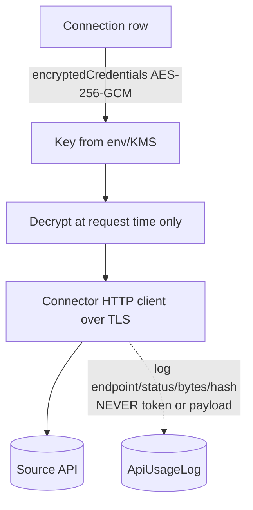

# FIN//HUB — Data Storage, Retention, Privacy & Security Architecture (#31)

> Status of this document: it describes (a) **what FIN//HUB stores today** — grounded in the
> actual Prisma data model and code paths — and (b) the **target policy/roadmap** where a
> capability is not yet implemented. Sections clearly mark *Implemented* vs *Proposed* so the
> document stays technically and legally accurate.

## 0. Strategic positioning

FIN//HUB is a **financial intelligence / normalization / consolidation / reporting-orchestration
layer**. It is explicitly **not** a permanent bookkeeping replacement or an unrestricted accounting
data warehouse. The source of truth for transactions remains the connected accounting systems
(Yuki, e-Boekhouden, …).

**Design consequence (already true in the codebase):** individual transactions and trial balances
are **retrieved on demand** from the source system per request and are **not written** to FIN//HUB's
database. What FIN//HUB persists is *configuration, mappings, public reference data, and
audit/usage metadata* — not the underlying ledger.

---

## 1 & 2. Complete data classification

Categories used: **PERSISTENT** (durable config/reference), **CACHE** (transient/derivable),
**ON-DEMAND** (never persisted; fetched per request), **AUDIT** (append-only, immutable),
**SECRET** (encrypted secrets).

Security classes: **Public**, **Internal**, **Confidential**, **Restricted (PII/secret)**.

| Data type | Model / path | Stored? | Class | Encryption | Retention | Deletion | GDPR impact |
|---|---|---|---|---|---|---|---|
| Connector credentials (Yuki accessKey, e-Boekhouden token) | `Connection.encryptedCredentials` | **SECRET** — yes | Restricted | **AES-256-GCM** at field level | Life of the connection | Deleted on connection/entity delete (cascade) | High — grants access to source books; never returned to the browser |
| 2FA TOTP secret | `User.twoFactorSecret` | **SECRET** — yes | Restricted | AES-256-GCM | Until 2FA disabled / user deleted | On user delete (cascade) | High |
| Password | `User.passwordHash` | yes | Restricted | **bcrypt** (one-way) | Life of user | On user delete | High |
| Session / refresh tokens | `RefreshToken.tokenHash` | yes (**hash only**) | Restricted | SHA-256 (one-way) | Until expiry/revoke | Revoked on logout; expiry cleanup | Medium |
| Invite / password-reset tokens | `UserToken.tokenHash` | yes (**hash only**) | Restricted | SHA-256 | Single-use, short TTL | Consumed/expired | Medium |
| **Output API keys** | `ApiKey.keyHash` | yes (**hash only**, raw shown once) | Restricted | SHA-256 | Until revoked/expired | `revokedAt` set; row kept for audit | Medium |
| OAuth tokens (future external IdP) | — | *not yet* | Restricted | Would be SECRET (AES) | n/a | n/a | — |
| Users / names / e-mail | `User` | yes | Restricted (PII) | DB-level (deployment) | Life of account | On user delete | High (personal data) |
| Profile photo | `User.avatarUrl` (data-URL) | yes | Confidential (PII) | DB-level | Until changed/removed | DELETE endpoint nulls it | Medium |
| Roles / memberships | `Membership` | yes | Internal | — | Life of access | On scope/user delete (cascade) | Low |
| Workspace / group / entity tree | `Workspace`/`Group`/`Entity` | yes | Internal | — | Life of tenant | Cascade on delete | Low |
| Workspace settings | `WorkspaceSettings` | yes | Internal | — | Life of workspace | Cascade | None |
| VAT mappings | `VatMapping` | yes | Confidential | — | Life of workspace | Cascade | Low |
| RGS mappings (source→RGS) | `SourceAccountMapping` | yes (**immutable, append-only**) | Confidential | — | Life of workspace (history kept) | Cascade on workspace/entity delete | Low — account-level, not transactional |
| FIN semantic categories | `FinSemanticCategory` | yes | Internal | — | Life | Cascade | None |
| Discovered GL accounts | `SourceAccount` (code, name, type) | yes (metadata, **not** balances/txns) | Confidential | — | Refreshed on sync | Cascade | Low |
| RGS taxonomy | `RgsAccount` | yes (**public standard**) | Public | — | Per version | Manual refresh | None |
| FX rates | `FxRate` (ECB daily) | yes (**public**, cache) | Public | — | Indefinite cache (re-derivable) | Safe to purge anytime | None |
| **Transactions** | connector `getTransactions()` | **ON-DEMAND — NOT stored** | Restricted (in transit) | TLS only | 0 (request-scoped memory) | n/a | **Minimized** |
| **Trial balances** | connector `getTrialBalance()` | **ON-DEMAND — NOT stored** | Restricted | TLS | 0 | n/a | Minimized |
| **Receivables / payables** | connector `getOutstanding()` | **ON-DEMAND — NOT stored** | Restricted | TLS | 0 | n/a | Minimized |
| **Relations / contacts** | connector `getDebtors()/getCreditors()` | **ON-DEMAND — NOT stored** | Restricted (PII) | TLS | 0 | n/a | Minimized |
| **PDF documents** | `getInvoicePdf()` → `res.end(bytes)` | **STREAMED — NOT stored** | Restricted | TLS | 0 | n/a | Minimized |
| Source document URLs | — (resolved per request) | not stored | — | — | 0 | n/a | Minimized |
| **Raw API payloads** | — | **NOT stored** (only SHA-256 hashes) | — | — | 0 | n/a | Minimized |
| API usage ledger | `ApiUsageLog` (metadata + hashes) | yes (**no payloads**) | Internal | DB-level | retention job (proposed) | Purge by age (proposed) | Low |
| Audit trail | `AuditLog` (action + metadata) | yes (append-only) | Internal | DB-level | Long (compliance) | Per retention policy | Low — avoid PII in metadata |
| Sync history | derivable from `ApiUsageLog` + `Connection.lastSyncAt` | partial | Internal | — | as usage ledger | — | Low |
| Notification history | *not yet* (#25) | *proposed* | Internal | — | configurable | per policy | Low |
| Error reports | *not yet* (#28) | *proposed* | Internal | — | configurable | per policy | Medium (must scrub PII) |
| Exports (Excel/CSV) | generated per request, streamed | not stored server-side | Restricted | TLS | 0 (lives in user's download) | n/a | Customer-controlled |
| Consolidation snapshots / elimination entries | *not yet* (RGS-B) | *proposed* | Confidential | — | configurable | per policy | Medium — derived figures |
| Billing (Stripe) | `Subscription` (ids, status) | yes (**no card data**) | Confidential | — | Life of account | Cascade | Low — Stripe is processor for payment data |
| Stripe webhook idempotency | `ProcessedStripeEvent` | yes (event ids) | Internal | — | Short | Purge by age | None |

---

## 3. Processing philosophy — what IS and is NOT stored

**Stored (persistent):** workspace/group/entity structure, users/roles, **mappings** (VAT, RGS,
FIN), discovered GL **account metadata**, workspace settings, **encrypted** connector credentials &
2FA secrets, **hashed** tokens/API keys, billing references (Stripe ids), public reference data (RGS
taxonomy, FX rates), and **audit/usage metadata** (action + hashes, *no payloads*).

**NOT stored (on-demand / transient):** individual **transactions**, **trial balances**,
**receivables/payables**, **relations/contacts**, **invoice PDFs/documents**, **source-document
URLs**, **raw API request/response payloads**, and **exports** (streamed to the user's browser).

**How long / why:** persistent items live for the life of the tenant because they are configuration
or reference data needed to interpret source data; transient items live only for the duration of a
single HTTP request (in process memory) because FIN//HUB re-fetches them from the source on demand.

> ⚠️ Accuracy guardrail: FIN//HUB does **not** "store no data". It stores configuration, mappings,
> reference data and audit metadata as listed above. It **minimizes** persistent storage of
> *transaction-level* accounting data and *secrets in plaintext*.

---

## 4. Configurable storage modes

> *Implemented today:* effectively **Mode A** (no persistent transaction storage). Modes B and C are
> the proposed roadmap; they introduce an opt-in cache/warehouse with explicit retention.

### A. Zero-storage mode *(current default)*
- No persistent transaction/trial-balance/document storage; everything fetched on demand.
- Only mappings, configuration, reference data, and audit/usage **metadata** persist.
- **Pros:** smallest attack surface & GDPR footprint; "source of truth stays in the books";
  trivial deletion story. **Cons:** every report re-hits the source API (latency, connector
  rate-limits, source availability dependency); no historical point-in-time once a period closes in
  the source; limited offline/large-scale analytics.

### B. Temporary cache mode *(proposed)*
- Transactions/trial balances cached with a **configurable TTL: 24h / 7d / 30d**, per workspace.
- Implemented as an encrypted cache table keyed by (entity, period, query-hash) with `expiresAt`
  + a background purge job; transparent cache-then-source read path.
- **Pros:** big latency win, fewer connector calls (cost/rate-limit), resilient to brief source
  downtime. **Cons:** now storing transaction data → larger GDPR footprint & retention obligations;
  cache invalidation complexity; must be encrypted at rest and covered by deletion flows.

### C. Enterprise warehouse mode *(proposed, explicit opt-in)*
- Customer explicitly chooses long-term storage (e.g., closed-period snapshots, consolidation
  results) for analytics/audit history.
- **Pros:** durable history, fast BI, consolidation snapshots, lineage over time. **Cons:** full
  accounting-data-warehouse responsibilities — retention policy, encryption at rest, backups, DPA
  scope, right-to-erasure handling, and clear contractual data-controller boundaries.

**Technical implication:** the storage mode is a **workspace setting** (extend `WorkspaceSettings`)
that switches the read path between *on-demand*, *cache-then-source*, and *warehouse*. Default = A.

---

## 5. Security architecture

| Area | Implemented today | Recommended target |
|---|---|---|
| **Encryption in transit** | TLS to all connectors (HTTPS) and Stripe; app served over HTTPS at the edge | Enforce HSTS; TLS 1.2+; mTLS for app↔DB on managed Postgres |
| **Encryption at rest (secrets)** | **AES-256-GCM** field encryption for connector creds + 2FA secret; bcrypt passwords; SHA-256 token/key hashes | Keep; add envelope encryption with a KMS-managed data key |
| **Encryption at rest (database)** | Deployment responsibility (disk/volume) | **Managed Postgres with encryption at rest** + automated PITR backups |
| **Secret management** | App secrets (AES key, JWT secret, Stripe keys) via environment (`config/env.ts`) | Move to a secrets manager (Vault/cloud KMS); no secrets in images/repo |
| **Key rotation** | Manual (env change) | Scheduled rotation for JWT signing + a versioned data-encryption key with re-wrap migration |
| **Access control** | JWT auth; per-scope RBAC via `Membership` (workspace/group/entity); platform-admin superuser; **read-only** API keys, GET-only, rate-limited | Add per-endpoint scopes for API keys; optional IP allow-list per key |
| **Tenant isolation** | Every query is scope-filtered by membership; connectors resolved per entity; API keys scoped to one workspace (optionally one entity) | Add row-level checks/tests as invariants; periodic isolation audits |
| **Audit logging** | `AuditLog` (append-only) for security-relevant actions (connection changes, mapping changes, billing, API-key create/revoke) | Tamper-evidence (hash chaining); ship to WORM/SIEM |
| **API usage logging** | `ApiUsageLog` — metadata + SHA-256 hashes only, **never tokens or payloads**; INBOUND/OUTBOUND + USER/API/SYSTEM channel | Retention job; per-key dashboards (built) |
| **Backup strategy** | *Not automated in the dev stack* | Managed Postgres PITR; encrypted, access-controlled, tested restores; backups inherit retention/erasure policy |
| **Deletion procedures** | Prisma `onDelete: Cascade` from Workspace→…→mappings/keys/etc.; immutable mappings keep history within the tenant | Documented workspace-erasure flow incl. cache purge + backup tombstoning |
| **Incident response** | Logs + audit trail | Runbook, breach-notification timeline (GDPR 72h), key-revocation playbook (built: API-key + connector revoke) |
| **Logging restrictions** | No secrets/payloads in logs; debug response logging is dev-only | Enforce structured-log scrubbing in prod; PII redaction filter |
| **Secure document retrieval** | PDFs fetched per request and **streamed** (`res.end(bytes)`); never written to disk/DB | Keep; short-lived signed source URLs only |
| **Secure API design** | Output API is read-only, key-authenticated, rate-limited, scoped, envelope-wrapped, fully usage-logged | Add OAuth2 client-credentials option + scopes |

---

## 6. Logging strategy

- **Stored logs:** `AuditLog` (action + minimal metadata) and `ApiUsageLog` (request/correlation
  ids, scope, endpoint, method, status, success, retries, duration, sizes, rate-limit, **SHA-256
  request/response hashes**, initiator/channel). Application logs (pino) for operations.
- **NOT stored in logs:** API keys, tokens, refresh tokens, connector credentials, raw request or
  response **bodies/payloads**, PDF bytes, transaction contents. Only **hashes + sizes** are kept,
  so payloads are *attestable but not reconstructable*.
- **Masking:** secrets are never passed to the logger; the SOAP envelope (which contains the Yuki
  accessKey/sessionID) is **never hashed or logged** — only the `service.method` label is.
- **Retention (proposed):** usage ledger 90–180 days rolling (configurable); audit trail longer for
  compliance; application logs short (e.g., 14–30 days) with PII scrubbing.

---

## 7. Privacy / GDPR architecture

- **Roles:** the customer (workspace owner) is the **data controller**; FIN//HUB is a **data
  processor** acting on documented instructions (the connections/mappings the customer configures).
  Stripe is a **sub-processor** for payment data; the accounting connectors are the upstream
  controllers/sources.
- **Data minimization:** the on-demand architecture means transaction-level personal data
  (e.g., debtor/creditor names) is processed transiently and **not persisted** by default.
- **Right to erasure / workspace deletion:** deleting a workspace cascades to its groups, entities,
  connections (and thus encrypted credentials), mappings, settings, API keys and source-account
  metadata. *Proposed:* a single audited "erase workspace" flow that also purges any caches
  (Mode B/C) and tombstones backups.
- **Exportability (portability):** mappings/config and (when enabled) cached/warehoused data are
  exportable via the Output API (JSON/CSV) and Excel exports.
- **Tenant isolation:** enforced by membership-scoped queries and per-workspace API keys.
- **Sub-processor considerations:** maintain a public sub-processor list (hosting/managed-DB,
  Stripe, e-mail/Graph, FX/ECB source); each under a DPA.
- **Auditability:** append-only `AuditLog` + `ApiUsageLog` provide who/what/when for config changes
  and data access (incl. external API access).

---

## 8. Public-facing statements

### 8a. Technical security philosophy
> FIN//HUB is built on a *data-minimization-first* principle. We treat the connected accounting
> systems as the source of truth and retrieve transaction-level data **on demand**, processing it
> transiently rather than persisting it. We store the minimum needed to do our job —
> configuration, mappings, public reference data, and tamper-evident audit/usage metadata — and we
> protect secrets with strong, field-level encryption. Every external data access is authenticated,
> scoped, rate-limited and logged.

### 8b. Customer-friendly security statement
> **Your books stay your books.** FIN//HUB connects to your accounting software to normalize,
> consolidate and report on your figures — it is not a copy of your bookkeeping. By default we do
> **not** store your individual transactions, trial balances or invoice PDFs; we fetch them when you
> open a report and discard them afterward. We do store the settings and mappings that make your
> reports work, and audit/usage records (without the underlying content). Connector credentials are
> encrypted; passwords and tokens are hashed; access is role-based and isolated per organization. You
> can revoke any connection or API key at any time, and deleting your workspace removes your
> configuration and credentials.

### 8c. Concise website trust statement
> *FIN//HUB normalizes and reports on your financial data without becoming a second bookkeeping
> system. By default your transactions and documents are retrieved on demand and not stored —
> encrypted credentials, role-based access, per-tenant isolation and full audit logging keep your
> data safe and your books the single source of truth.*

> ⚠️ Use 8a–8c **only while Mode A is the active default.** If a workspace enables cache/warehouse
> modes (B/C), update the statement to reflect that transaction data is then stored (encrypted, with
> a stated retention period).

---

## 9. Architecture diagrams

### 9a. Data-flow: on-demand reporting (transient)
```mermaid
flowchart LR
  U[User / external API client] -->|HTTPS+auth| API[FIN//HUB API]
  API -->|scope check (membership / API key)| RES[Resolve connector for entity]
  RES -->|decrypt creds (AES-GCM)| CONN[Connector client]
  CONN -->|TLS request| SRC[(Accounting system\nYuki / e-Boekhouden)]
  SRC -->|transactions / TB / PDF| CONN
  CONN -->|apply VAT + RGS + FX in memory| API
  API -->|stream result| U
  API -.->|metadata + hashes only| LEDGER[(ApiUsageLog / AuditLog)]
  note1[/Transactions, TB, PDFs:\nNEVER written to DB/]:::n -.- API
classDef n fill:#fff3cd,stroke:#e0a800;
```

### 9b. Persistent vs transient storage
```
PERSISTENT (DB)                         TRANSIENT (request memory only)
  • Workspace/Group/Entity                • Transactions
  • Users / Memberships                   • Trial balances
  • Mappings (VAT / RGS / FIN)            • Receivables / payables
  • SourceAccount metadata                • Relations / contacts
  • WorkspaceSettings                     • Invoice PDFs (streamed)
  • Connection (creds: AES-GCM)          • Raw API payloads (only hashed)
  • Tokens / API keys (hash only)         • Exports (streamed to browser)
  • RgsAccount / FxRate (public)
  • AuditLog / ApiUsageLog (metadata)
```

### 9c. Connector security model


### 9d. Secure document retrieval
```
User clicks invoice → API (auth+scope) → connector.getInvoicePdf(ref)
   → source returns bytes over TLS → API streams bytes to user (res.end)
   → nothing written to disk or DB → usage logged (metadata only)
```

---

## 10. Recommendations

1. **Default storage model = Mode A (Zero-storage).** It is already the implemented behavior and is
   the strongest trust/privacy posture. Keep it as the default and the marketing baseline.
2. **Offer Mode B (cache, opt-in)** for performance-sensitive workspaces, encrypted at rest with a
   24h/7d/30d TTL and a purge job; clearly disclose the changed retention in-product.
3. **Reserve Mode C (warehouse)** for enterprise customers who explicitly want history, under a DPA
   with documented retention, backups and erasure.
4. **Harden the platform basics** before enterprise sales: managed Postgres with encryption at rest
   + automated, tested PITR backups; secrets in a KMS; scheduled key rotation; log scrubbing in prod.
5. **Accounting/audit implications:** the source system remains the legal book of record; FIN//HUB
   provides lineage (mapping history is immutable) and audit/usage trails. Snapshots (Mode C) must be
   labeled as *derived* figures, not the statutory ledger.
6. **Performance:** Mode A trades latency/connector-load for minimal storage; mitigate with Mode B
   caching where the customer accepts the retention trade-off.
7. **Security trade-off:** persistence (B/C) increases the breach blast-radius; compensate with
   encryption at rest, strict retention, and per-tenant isolation tests.
8. **Compliance trade-off:** more persistence = more GDPR obligations (retention, erasure, DPA
   scope). Keep persistence *opt-in and per-workspace* so the obligation follows the choice.

---

*Implemented today, verified in code:* on-demand transaction/TB/PDF retrieval (no persistence),
AES-256-GCM connector-credential & 2FA-secret encryption, bcrypt passwords, hash-only tokens/API
keys, read-only/rate-limited/usage-logged Output API, membership-scoped tenant isolation, append-only
audit + usage ledgers that store hashes — not payloads. *Proposed/roadmap:* cache/warehouse modes,
automated backups, KMS + key rotation, retention jobs, formal workspace-erasure flow, DPA/sub-processor
documentation.
